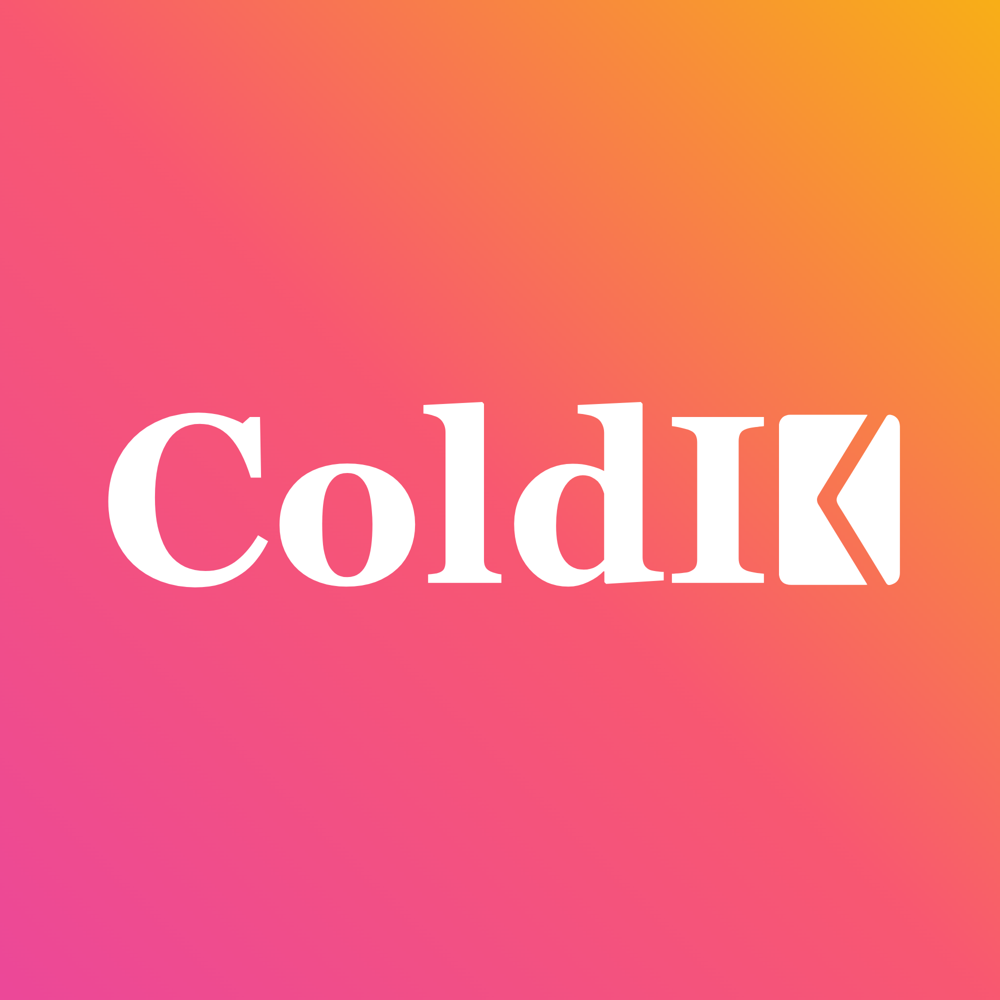

<div align="center">


<!-- Typing animation -->
<a href="https://github.com/parvarora">
  
</a>

<br/>

<!-- Quick badges -->
<a href="https://www.linkedin.com/in/parv-arora-passionate1603"></a>
<a href="mailto:parvarora1603@gmail.com"></a>
<a href="https://coldie.web.app"></a>
<a href="https://sharein-917a1.web.app/login"></a>
<br/>


</div>

<!-- ====================== ABOUT ====================== -->

##  &nbsp; About Me

```python
class ParvArora:
    role        = "AI Engineer"
    location    = "India 🇮🇳"
    now         = "AI Research Intern @ IIT Jammu"
    past        = "Research Intern @ ISRO"
    focus       = ["GenAI", "LLMs", "RAG", "Agentic Workflows"]
    superpower  = "turning research papers into products that ship"
    currently   = "zero-day & generic cyber-attack detection with generative + agentic AI"
    fun_fact    = "I use the two apps I built (ColdIE & ShareIn) almost every day"
```

- 🧠 Currently building a **zero-day & generic cyber-attack detection** architecture (Mamba + MoE) using generative & agentic AI at **IIT Jammu**.
- 🛰️ At **ISRO**, I architected a big-data pipeline over **~160 GB** of Akatsuki satellite data → **1.5B+** analysis-ready observations, and trained ML models predicting Venusian cloud-top reflectance (**R² = 0.998**, **RMSE = 0.009**).
- 🚀 I don't just prototype — I ship. Two of my products (**ColdIE** & **ShareIn**) are live and used in the real world.
- 🏆 2nd Runner-Up (out of 85 teams) @ IIT Jammu Hackathon · Ex Coding-Club President (300+ students).

<br/>

<!-- ====================== EXPERIENCE ====================== -->

##  &nbsp; Experience

<table>
  <tr>
    <td align="center" width="150">
      <br/>
      <b>IIT Jammu</b>
    </td>
    <td>
      <b>AI Research Intern</b> &nbsp;·&nbsp; <i>Jan 2026 – Present</i><br/>
      Implementing a <b>zero-day &amp; generic cyber-attack detection</b> architecture using generative &amp; agentic AI to automate detection and reasoning. Built a <b>Mamba + MoE</b> architecture based on an industry-recognized research paper.
    </td>
  </tr>
  <tr>
    <td align="center" width="150">
      <br/>
      <b>ISRO</b>
    </td>
    <td>
      <b>Research Intern</b> &nbsp;·&nbsp; <i>Jun – Sept 2025</i><br/>
      Architected a big-data pipeline processing <b>~160 GB</b> of Akatsuki satellite data into <b>1.5B+</b> analysis-ready observations with physics-informed preprocessing. Trained ML models predicting Venusian cloud-top reflectance — <b>R² = 0.998</b>, <b>RMSE = 0.009</b>.
    </td>
  </tr>
</table>

<br/>

<!-- ====================== FEATURED PRODUCTS ====================== -->

##  &nbsp; Featured Products &nbsp;<sub><i>(live & in daily use)</i></sub>

<table>
<tr>
<!-- ColdIE -->
<td width="50%" valign="top">
<div align="center">

<h3>ColdIE — Personalized bulk emails</h3>
</div>

Send <b>50 personalized cold emails in one click</b>, get the small details right (smart honorifics, `{placeholders}`, AI contact extraction), and <b>track every reply</b> — so reaching out feels less cold and more <i>you</i>.

<sub>**Stack:** React 19 · TypeScript · Vite · Tailwind 4 · Node/Express · Gemini · Firebase · Gmail API</sub>

<div align="center">
<a href="https://coldie.web.app"></a>
<a href="./products/coldie.md"></a>
</div>
</td>

<!-- ShareIn -->
<td width="50%" valign="top">
<div align="center">

<h3>ShareIn — Universal Job Saver</h3>
</div>

Saw a job while scrolling but can't apply right now? <b>Tap “Share → ShareIn”</b> from any app (LinkedIn, Naukri, Indeed, Glassdoor), set a deadline in 2 clicks, and it <b>reminds you before you miss it</b>. A friction-free PWA — no heavy AI, just a smart URL-to-title algorithm.

<sub>**Stack:** Progressive Web App · Firebase · Web Share Target API · Push Notifications</sub>

<div align="center">
<a href="https://sharein-917a1.web.app/login"></a>
<a href="./products/sharein.md"></a>
</div>
</td>
</tr>
</table>

<br/>

<!-- ====================== PINNED PROJECTS ====================== -->

##  &nbsp; Pinned Projects

<table>
<tr>
<td valign="top" width="190" align="center">
<br/>🎬<br/>
<b><a href="https://github.com/parvarora/deepshorts">DeepShorts</a></b><br/>
<sub>AI Bollywood Script Generator</sub><br/><br/>
<a href="https://deepshorts-6c29a.web.app"></a>
<a href="https://github.com/parvarora/deepshorts"></a>
</td>
<td valign="top">
Hand it one everyday situation; a resilient <b>multi-agent (LangGraph)</b> "writers' room" returns a full blockbuster — title, tagline, cast, and a multi-scene <b>Hinglish</b> script — streamed <b>live over WebSocket</b> as each agent (Architect → Screenwriter → Script Doctor → Finalize) thinks. 16 moods, 10 director styles, regenerate any part.<br/>
<sub><code>React · Vite · TypeScript · FastAPI (Cloud Run) · LangGraph · Gemini</code></sub>
</td>
</tr>

<tr>
<td valign="top" width="190" align="center">
<br/>🎓<br/>
<b><a href="https://github.com/parvarora/Personalized-AI-Academic-Tutor">AI Academic Tutor</a></b><br/>
<sub>Textbook-grounded RAG</sub><br/><br/>
<a href="https://github.com/parvarora/Personalized-AI-Academic-Tutor"></a>
</td>
<td valign="top">
Answers strictly from source material: <b>multi-query retrieval + Reciprocal Rank Fusion</b> over a Qdrant vector store, a <b>Neo4j knowledge graph</b> for entity/relationship reasoning, and <b>mem0</b> long-term memory for per-student personalization.<br/>
<sub><code>Python · LangChain · Gemini · Qdrant · Neo4j · mem0 · Streamlit</code></sub>
</td>
</tr>

<tr>
<td valign="top" width="190" align="center">
<br/>🎙️<br/>
<b><a href="https://github.com/parvarora/Voice-Operated-Cursor">Voice Coding Agent</a></b><br/>
<sub>Hands-free agentic coding</sub><br/><br/>
<a href="https://github.com/parvarora/Voice-Operated-Cursor"></a>
</td>
<td valign="top">
A <b>LangGraph</b> state machine cleanly separates reasoning from tool execution, runs multi-step file/CLI operations in an isolated workspace, and persists <b>checkpointed state in MongoDB</b> for resumable, long-running sessions.<br/>
<sub><code>Python · LangGraph · Gemini · MongoDB · Docker · SpeechRecognition</code></sub>
</td>
</tr>
</table>

<br/>

<!-- ====================== TECH STACK ====================== -->

##  &nbsp; Tech Stack

**🧠 AI / ML**


**💻 Languages & Web**


**🗄️ Data & Infra**


<br/>

<!-- ====================== GITHUB ANALYTICS ====================== -->

##  &nbsp; GitHub Analytics

<div align="center">


<br/>


<br/>


</div>

<br/>

<!-- ====================== ACHIEVEMENTS ====================== -->

##  &nbsp; Achievements & Leadership

- 🏆 **Hackathon** — 2nd Runner-Up out of **85 teams** @ IIT Jammu (vulnerability detection for Play Store apps).
- 👑 **Coding Club President** — led a **300+ student** community; ran competitions with 100+ active participants.
- 📈 **2nd-Sem CSE Branch Topper** — SGPA **9.55**.
- 🎖️ **NPTEL Elite** — “Problem Solving Through Programming in C” (Top 5%).
- 🌐 **Community Growth** — strategized content to grow the college LinkedIn page to **5000+** followers.
- 💻 **TCS CodeVita** — international rank **3011** among **1.6L+** participants.

<br/>

<!-- ====================== FOOTER ====================== -->

<div align="center">

### Let's build something great together 🤝

<a href="https://www.linkedin.com/in/parv-arora-passionate1603"></a>
<a href="mailto:parvarora1603@gmail.com"></a>
<a href="https://github.com/parvarora"></a>


</div>
